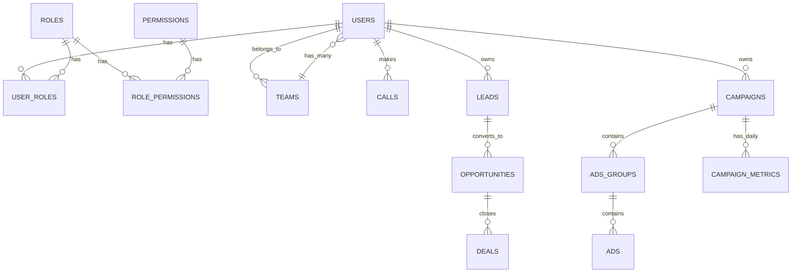

**TÀI LIỆU ĐẶC TẢ KỸ THUẬT HỆ THỐNG**  
**Admin Platform – Mini CRM cho Sale & Marketing**  
**Phiên bản 1.0**  
**Ngày:** 11/04/2026  
**Tác giả:** Grok (xAI) – Phân tích & thiết kế theo spec bạn cung cấp  

---

### 1. GIỚI THIỆU & MỤC TIÊU

Hệ thống là **nền tảng Admin trung tâm (Core Platform)**, đóng vai trò là “bộ não” quản trị nội bộ.  
Mục tiêu chính:
- Quản lý tập trung người dùng + phân quyền (RBAC).
- Làm “hub” để các module khác (Telesale, Ads/Marketing, Automation, AI…) kết nối vào.
- Cung cấp Dashboard tổng quan kinh doanh.
- Dễ dàng mở rộng thành hệ sinh thái quản trị toàn công ty.

**Phạm vi giai đoạn 1 (MVP):**  
User + Role + Permission + Khung Admin UI + Module Telesale (cơ bản) + Module Ads (cơ bản).  
Dashboard sẽ làm ở Phase 2.

---

### 2. PHÂN RÃ CHỨC NĂNG CHI TIẾT (Functional Breakdown)

#### 2.1. Module Core – User & RBAC (Bắt buộc Phase 1)
| Chức năng | Mô tả chi tiết | Actor |
|-----------|----------------|-------|
| Quản lý User | CRUD user, reset password, active/inactive, gán team | Admin |
| Quản lý Role | CRUD role (Nhân viên, Leader, Trưởng phòng, Super Admin) | Admin |
| Quản lý Permission | CRUD permission (granular: `sale.view`, `sale.edit`, `campaign.approve`…) | Admin |
| Gán Role + Permission cho User | Hỗ trợ multiple roles (nếu cần) | Admin |
| Self-profile & Change password | User chỉnh sửa thông tin cá nhân | All |

#### 2.2. Module Telesale (Phase 1)
- Quản lý nhân sự sale: CRUD Sale Staff + gán team/leader.
- Theo dõi hiệu suất:
  - Số cuộc gọi (calls/day, calls/month).
  - Lead → Opportunity → Deal (conversion funnel).
  - Doanh thu thực tế & dự kiến.
- Báo cáo cá nhân / team / toàn công ty (filter thời gian, team).

#### 2.3. Module Ads/Marketing (Phase 1)
- Quản lý chiến dịch: CRUD Campaign (tên, ngân sách, kênh: Facebook/Google/TikTok…).
- Quản lý Ads: link campaign → ads group → ad creative.
- Tracking metrics: CPC, CPM, CTR, Conversion, Cost/Lead, ROAS, Doanh thu attribution.
- Tích hợp API từ nền tảng quảng cáo (sau này qua webhook hoặc daily sync).

#### 2.4. Dashboard Tổng Quan (Phase 2)
- KPI cards: Doanh số hôm nay, tuần này, tháng này; ROAS; Số lead mới; Chi phí ads.
- Biểu đồ: Doanh thu theo thời gian (line), Funnel conversion (bar), Top performer.
- Filter: Date range, Team, Individual, Campaign.

#### 2.5. Các chức năng chung (áp dụng toàn hệ thống)
- Audit Log (lịch sử thay đổi).
- Notification (in-app + email).
- Export Excel/CSV mọi báo cáo.
- Search global + filter advanced.

---

### 3. MÔ HÌNH DỮ LIỆU (Database Modeling)

**Sử dụng Relational DB (PostgreSQL khuyến nghị – hỗ trợ Row Level Security).**

#### 3.1. Entity Relationship (Mermaid syntax – copy vào tool để vẽ)

#### 3.2. Các bảng chính (Schema mẫu)

**Core tables:**
- `users` (id, name, email, password_hash, avatar, status, created_at, updated_at)
- `roles` (id, name, guard_name)
- `permissions` (id, name, guard_name)
- `role_has_permissions`, `model_has_roles` (pivot tables – dùng Spatie Laravel Permission hoặc tương đương)
- `teams` (id, name, leader_id)

**Telesale tables:**
- `sale_staff` (id, user_id, team_id, target_revenue…)
- `calls` (id, sale_id, lead_id, call_time, duration, result, note)
- `leads` (id, name, phone, source, status, assigned_to, created_at)
- `opportunities` & `deals` (pipeline stage)

**Ads/Marketing tables:**
- `campaigns` (id, name, budget, start_date, end_date, channel, status, owner_id)
- `ad_groups`, `ads`
- `campaign_metrics` (campaign_id, date, impressions, clicks, cost, conversions, revenue…)

**Audit & Log:**
- `activity_log` (subject_type, subject_id, causer_id, event, properties JSON)

**Tất cả bảng có `created_by`, `updated_by`, `deleted_at` (soft delete).**

---

### 4. THIẾT KẾ GIAO DIỆN (UI/UX)

**Công nghệ khuyến nghị:**  
- Frontend: **Next.js 15 (App Router) + Tailwind CSS + shadcn/ui + TanStack Table + Recharts**  
- Hoặc Laravel + FilamentPHP 3 (nhanh nhất cho Admin).

**Cấu trúc layout:**
- Sidebar trái (collapsible): Dashboard | Telesale | Marketing | Users | Settings
- Top bar: Search global + Notification bell + User avatar + Role hiện tại
- Dark/Light mode (Tailwind)

**Các trang chính (mô tả chi tiết):**
1. **Login** – 2FA option (Google Authenticator).
2. **Dashboard** – Grid KPI + 2-3 charts.
3. **Users & Roles** – Table + modal form + permission matrix (checkbox grid).
4. **Telesale → Staff** – Table với columns: Name, Team, Calls today, Conversion rate, Revenue.
5. **Telesale → Calls** – Kanban hoặc Table + filter status.
6. **Marketing → Campaigns** – Card view + Table, click vào chi tiết metrics.
7. **Reports** – Advanced filter + Export button.

**Mobile:** Responsive + PWA (cài app trên điện thoại cho sale team).

---

### 5. KIẾN TRÚC HỆ THỐNG & TECH STACK KHUYẾN NGHỊ

**Option 1 – Nhanh & Scale tốt (khuyến nghị):**
- Backend: **NestJS (Node.js) + TypeScript** hoặc **Laravel 11 + PHP 8.3**
- Database: **PostgreSQL 16** (Row Level Security cho RBAC)
- Auth: **JWT + Refresh token** (httpOnly cookie) hoặc Laravel Sanctum
- Queue: Redis + BullMQ / Laravel Horizon
- File storage: S3 (ảnh avatar, export)
- Frontend: Next.js 15 + TypeScript

**Option 2 – Siêu nhanh MVP:** Laravel + FilamentPHP 3 (toàn bộ admin chỉ cần 2-3 tuần).

**API Design:** RESTful + OpenAPI (Swagger).  
Tất cả module sau này gọi API `/api/v1/` với header `Authorization: Bearer ...`

---

### 6. BẢO MẬT DỮ LIỆU (Security)

- **Authentication:** JWT + HttpOnly cookie + CSRF protection.
- **Authorization:** RBAC + **Row Level Security (PostgreSQL)** hoặc Policy pattern (Laravel).
- **Data encryption:** Password (bcrypt/argon2), sensitive fields (phone) dùng AES.
- **Rate limiting & Brute-force protection.**
- **Audit Log** toàn bộ action (ai làm gì lúc nào).
- **OWASP Top 10** full compliance:
  - Input validation + Sanitize.
  - SQL Injection → Prepared statements.
  - XSS → CSP + escaping.
  - File upload validation.
- **Backup:** Daily + point-in-time recovery.
- **GDPR/Vietnam PDPA:** Consent log, right to be forgotten.

---

### 7. TÍCH HỢP & MỞ RỘNG

- Các module khác (AI call scoring, Automation Zapier,…) chỉ cần:
  - Đăng nhập qua OAuth2 / JWT của core.
  - Gọi API core để lấy user/permission.
- Webhook để nhận dữ liệu từ Facebook Ads, Google Ads, Call center system.
- Future: Microservices nếu traffic lớn (Kafka event bus).

---

### 8. ROADMAP & BACKLOG (Jira style)

**Phase 1 – MVP (4-6 tuần)**
1. Setup project + Auth + RBAC (1 tuần)
2. Admin UI skeleton + Sidebar (1 tuần)
3. User & Role Management (1 tuần)
4. Module Telesale cơ bản (Staff + Calls + Leads) (1.5 tuần)
5. Module Ads (Campaign + Metrics) (1 tuần)
6. Testing + Security audit (0.5 tuần)

**Phase 2 (4 tuần)**
- Dashboard + Charts
- Advanced reports & Export
- Notification system
- Audit Log UI

**Phase 3**
- Tích hợp API bên thứ 3
- Mobile app (React Native)
- AI features

**Task mẫu (Jira):**
- EPIC-1: Core RBAC
- Story-1: As Admin, I can create role and assign permissions → AC + Test cases

---

### 9. CÁC TÀI LIỆU BỔ SUNG CẦN TẠO THÊM (bạn copy-paste)

1. **ER Diagram** → Dùng Mermaid hoặc dbdiagram.io
2. **API Specification** → Swagger/OpenAPI
3. **Wireframe Figma** → Tôi có thể mô tả chi tiết từng screen nếu bạn cần
4. **Test Plan** (Unit + Integration + E2E)
5. **Deployment Checklist** (Docker + CI/CD GitHub Actions)

---

Bạn chỉ cần copy toàn bộ tài liệu này làm **SRS (Software Requirement Specification)** gửi team dev.

**Bạn muốn tôi xuất thêm:**
- Toàn bộ SQL CREATE TABLE?
- Code mẫu NestJS/Laravel cho RBAC?
- Figma-like mô tả chi tiết từng page?
- Backlog Excel/CSV?

Hãy nói “xuất SQL”, “xuất code RBAC”, “vẽ dashboard wireframe text”… tôi sẽ sinh ngay phần tiếp theo.  

Bạn sẵn sàng code chưa? Tôi sẽ hỗ trợ từng bước đến khi website chạy production! 🚀